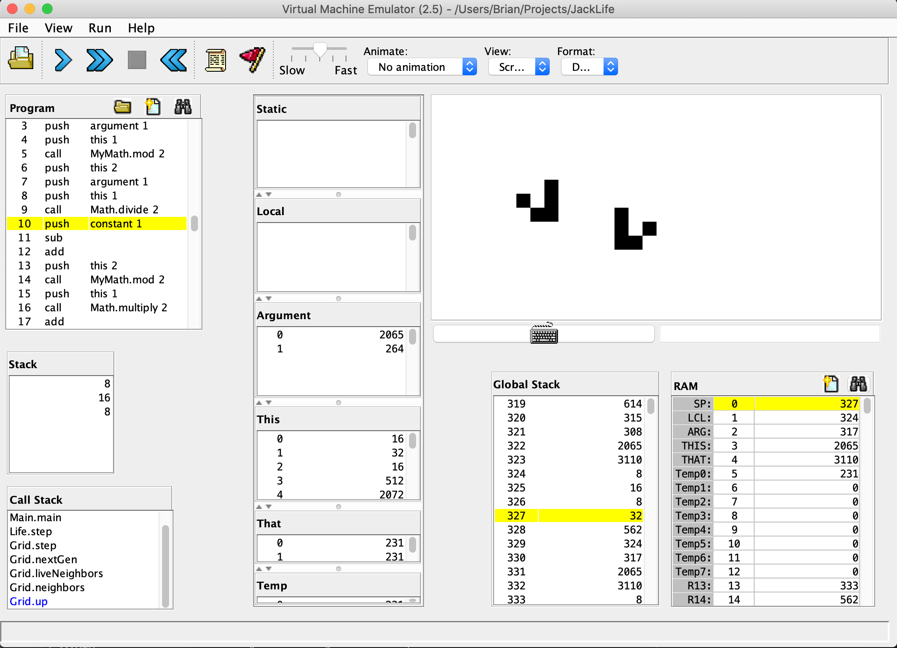

# Jack's Game of Life

[Conway's Game of Life](https://en.wikipedia.org/wiki/Conway%27s_Game_of_Life) implemented in Jack, the relatively minimalist programming language used (and developed) in the [Coursera](https://www.coursera.org/learn/nand2tetris2) course [Nand2tetris](https://www.nand2tetris.org) Part 2. 

Beginning from a user-set seed state, the grid iterates regularly to kill/activate cells according to the rule of Conway's Game of Life. Edges wrap so the far right cell considers the far left cell its neighbor, same for top and bottom.

Jack is a Java-like barebones object-oriented language that runs on the Hack virtual platform that is developed over the course of nand2tetris. Programs written in Jack are run using a virtual machine emulator, which generates an interface consisting of a 512 x 256 pixel screen, and basic keyboard input, and behave as though it were operating with the hardware developed in [nand2tetris part 1](https://www.coursera.org/learn/build-a-computer), where you build up from basic logic gates to a fully functional CPU. Life seemed an easier first step than Tetris.

## Launching the Program

1. Run the Hack virtual machine platform by launching VMEmulator&#46;sh (in /utils) from Terminal 
   - (you can also download this and the other shell utility files [none of which are needed to run this program] from the nand2tetris course website [itself](https://www.nand2tetris.org/software) if that feels better)
2. Click Load Program (folder icon) and select the entire JackLife directory (must contain all the .vm files)
3. Click "Yes" on the confirmation message saying "No implementation was found..." (this is allowing the emulator to use built-in OS classes like `Keyboard` and `Screen`)
3. Select "No animation" in the "Animation" dropdown menu (unless you feel like watching thousands of VM stack-manipulating operations go by for hours)
4. Click the Run button (double right arrow) or press F5 to run the program!

## Using the App

1. Enter cell size in pixels at startup screen. 
   * The VM is fairly slow, and as implemented right now I get about 1 grid generation per second if I choose a cell size of 16 pixels. Larger cells = less update logic = faster refresh rate. I expect this could be optimized. Cell sizes under 4 pixels won't work because of memory errors I might fix eventually. 5px cell size takes about 8 seconds per frame update.
2. Draw an initial grid state. The initial version here has very basic drawing interface. The exact logic of the drawing stage is:

   * Single arrow key presses move the "cursor" square
   * Pressing spacebar will make the cursor leave a "living" cell behind when it moves next
   * Otherwise, after moving the cell will be left blank (i.e. default behavior of the cursor is as an eraser)
3. Press escape to begin automaton animation.
4. To stop, press the stop button, to start over click the double left arrow, and then the run.

### Modifying the App

If you feel like playing with the code, you probably already know how the basic Hack environment works, but essentially you make whatever changes you want to the .jack code, then run JackCompiler&#46;sh in the code directory to update all the .vm files, and then the VMEmulator will run the new code next time you load the program. I've included the basic [Jack OS API](./Jack_OS_API.pdf) pdf for reference, but you'll need to know more about the language of course (covered in [Module 3](https://www.coursera.org/learn/nand2tetris2/supplement/Akcna/module-overview-start-here) of Nand2tetris Part 2)

#### Changelog

10/12/2020:
* Got it working. May or may not tweak it at all in the future. Made my first real GH repo which was fun.
